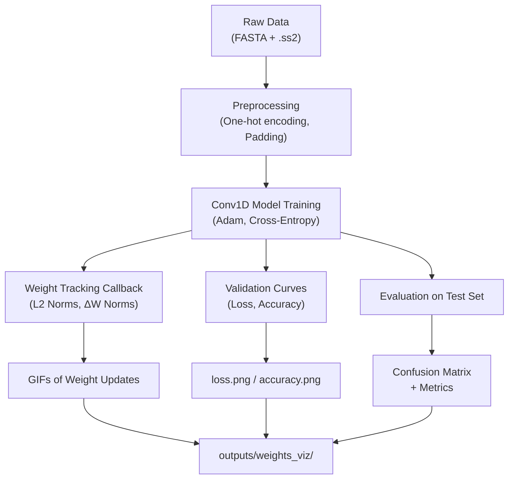

# 🧬🔬 Protein 2D Structure Prediction Using Deep Learning

*A deep learning pipeline for per-residue protein secondary structure classification (H, C, B) from FASTA sequences, featuring Conv1D architectures, automatic GIF visualization of weight updates, and evaluation plots.*

---

## 1. Problem Statement

Understanding a protein’s **secondary structure** (2D structure: α-helices, β-strands, coils) from its amino acid sequence is fundamental in computational biology.  
Traditional experimental methods (e.g., X-ray crystallography, NMR) are accurate but **expensive and time-consuming**.

This project implements a **fully automated deep learning workflow** to:
- Encode protein sequences from **FASTA** format.
- Map secondary structure labels from `.ss2` files (H, C, B).
- Train a Conv1D neural network for **per-residue classification**.
- Generate **training and validation curves**.
- Visualize **layer weight updates** over time via GIFs.

---

## 2. The Data: From Raw to Encoded

Data is sourced from **NCBI** for sequences and from **PSIPRED/DSSP** for secondary structure annotations.

- **Raw Data:** Located in `/data/raw/`  
  - `sequences.fasta` → amino acid sequences.  
  - `<sequence_id>.ss2` → per-residue secondary structure labels.

- **Data Processing:**
  - One-hot encoding over 20 canonical amino acids.
  - Mapping: `H` → 0, `C` → 1, `E` → `B` (2).
  - Padding sequences to the maximum length in the dataset.

- **Final Encoded Data:** Arrays ready for deep learning are generated in memory (optional save to `/data/processed/`).

---

## 3. Tech Stack

| Category | Technologies |
|---|---|
| **Deep Learning** | TensorFlow / Keras |
| **Data Processing** | Python, NumPy, Pandas, Biopython |
| **Visualization** | Matplotlib, Seaborn, ImageIO |
| **ML Utilities** | scikit-learn |
| **Version Control** | Git, GitHub |

---

## 4. Workflow & Key Steps

### 4.1. Preprocessing
- Load sequences and labels.
- One-hot encode amino acids.
- Align sequence lengths with padding.
- Train/validation/test split.

### 4.2. Model Development
- Conv1D layers to capture local residue patterns.
- Dropout for regularization.
- Softmax output for per-residue classification into H, C, B.

### 4.3. Training & Tracking
- Loss: **categorical cross-entropy**
- Optimizer: **Adam**
- Metrics: Accuracy
- **Custom callback** (`Conv1DFilterLinesCallback`) to:
  - Track filter L2 norms and ΔW norms each epoch.
  - Save per-epoch PNG plots.
  - Create GIF animations of weight evolution.

### 4.4. Evaluation
- Generate loss and accuracy curves.
- Compute confusion matrix and classification report.
- Save all outputs to `outputs/` directory.

---

## 5. Directory Structure

```text
protein-2d-structure/
├─ data/
│  ├─ raw/                 # FASTA + .ss2 inputs
│  └─ processed/           # Optional: cached numpy arrays
├─ outputs/
│  ├─ figures/             # loss.png, accuracy.png, confusion_matrix.png
│  ├─ metrics/             # history.csv, classification_report.txt
│  ├─ models/              # protein_cnn.h5
│  └─ weights_viz/         # GIFs and PNG frames per Conv1D layer
├─ src/
│  ├─ preprocess.py        # Load FASTA + SS2, encode, save arrays
│  ├─ train.py             # Build model, train, save model and plots
│  ├─ evaluate.py          # Test set evaluation, confusion matrix, report
│  └─ callbacks.py         # Conv1DFilterLinesCallback for weight GIFs
├─ sequences.fasta         # Example FASTA
├─ requirements.txt
├─ README.md
└─ .gitignore
```
## 6. Visualizations

### 6.1. Weight Update GIFs
- `*_l2.gif` — L2 norm per filter across epochs  
- `*_dl2.gif` — Magnitude of weight updates per filter  
Files are saved under:
**outputs/weights_viz/<layer_name>/<layer_name>_l2.gif**
**outputs/weights_viz/<layer_name>/<layer_name>_dl2.gif**

### 6.2. Training Curves
- `loss.png` — Train vs validation loss  
- `accuracy.png` — Train vs validation accuracy  
Files are saved under:
outputs/figures/loss.png
outputs/figures/accuracy.png

### 6.3. Confusion Matrix
- `confusion_matrix.png` — Per-residue classification results on test set  
Saved under:
outputs/figures/confusion_matrix.png
## 7. How to Run This Project

### Prerequisites
- Python 3.8+
- Virtual environment recommended

### Steps

**Clone the repository:**
```bash
git clone https://github.com/<your-username>/protein-2d-structure.git
cd protein-2d-structure
```
```bash
python -m venv venv
# Linux/Mac
source venv/bin/activate
# Windows
venv\Scripts\activate
```
```bash
pip install -r requirements.txt
python src/train.py
python src/evaluate.py
```
## 8. Mermaid Diagram – Project Flow



